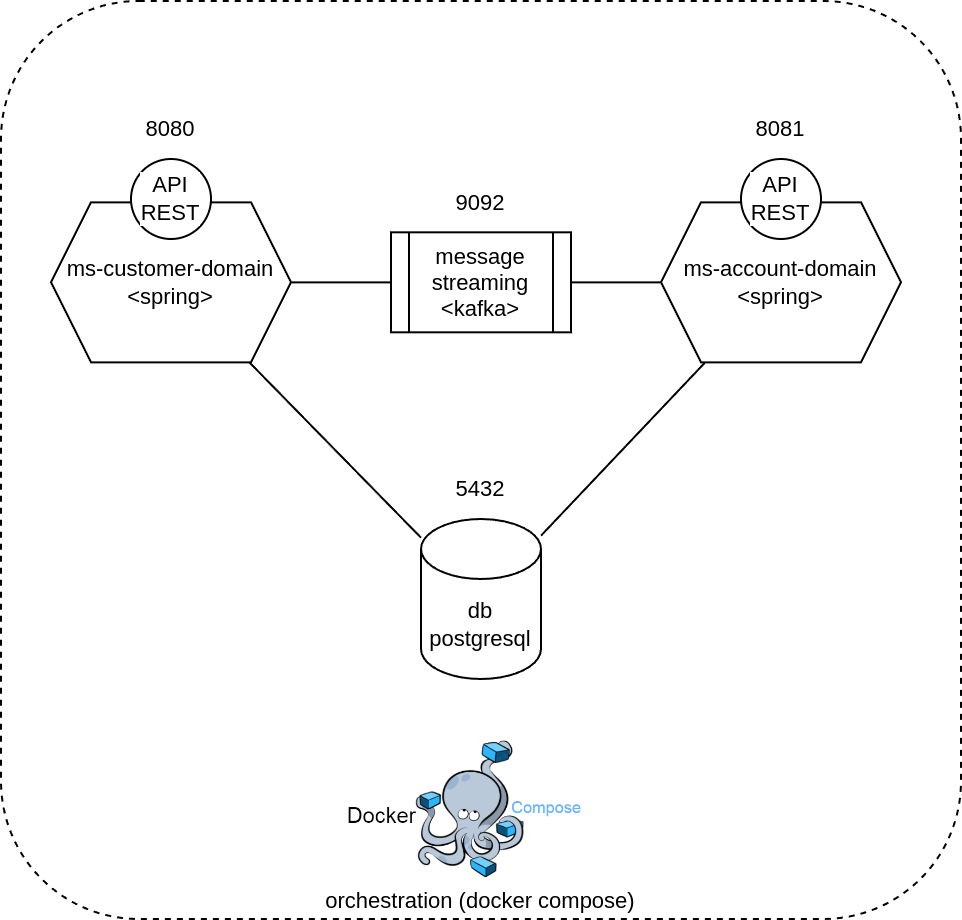
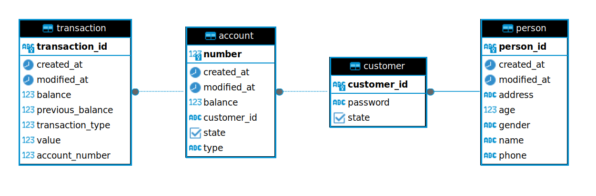
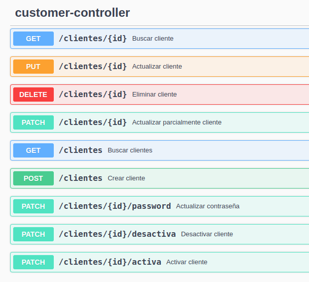
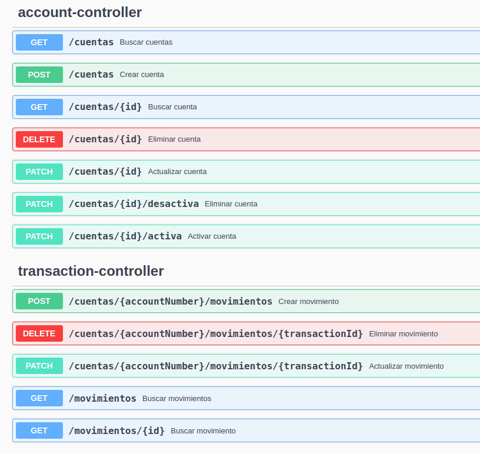
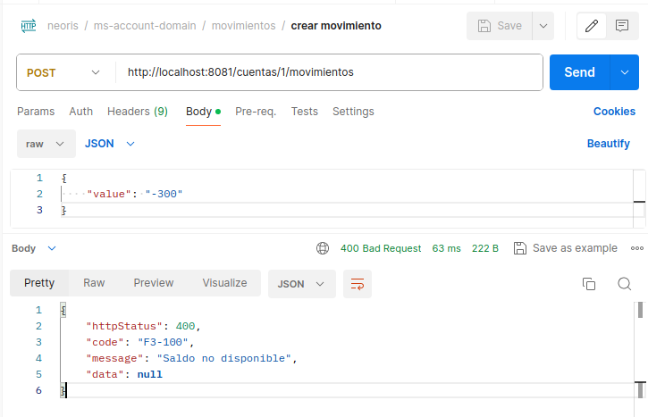
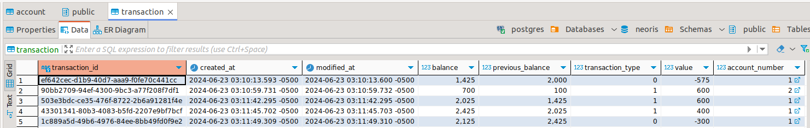
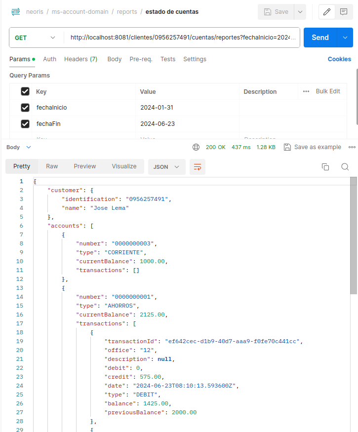
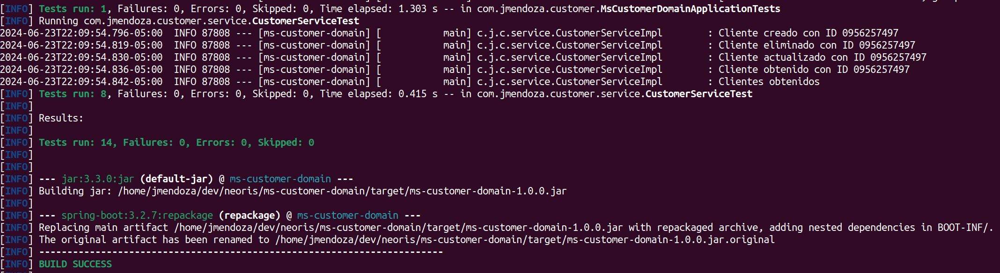
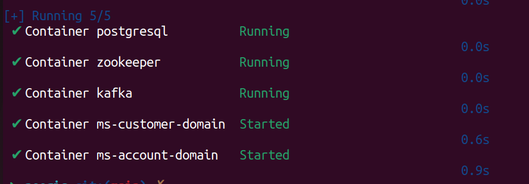
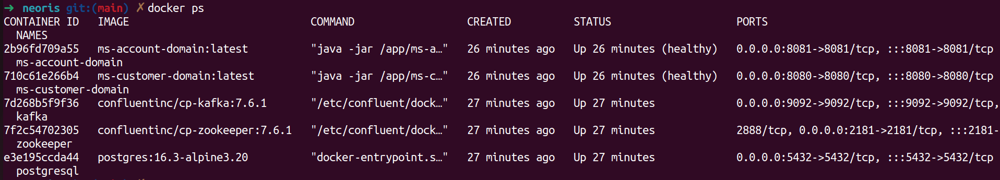

# Prueba, por Jeanpier Mendoza 🇪🇨

## Stack Tecnológico 🧑‍💻

- **Java 21**: como lenguaje de programación.
- **Spring Boot 3.2.7**: para el marco de trabajo de los microservicios.
- **JPA**: para el mapeo objeto-relacional y conexión con base de datos.
- **PostgreSQL 16.3**: como motor de base de datos.
- **Apache Kafka 7.6.1**: para la mensajería y comunicación asíncrona entre microservicios.
- **Docker 26 y Docker Compose v2**: para la orquestación de los contenedores de los componentes.
- **Maven 3**: para la gestión de dependencias y construcción del proyecto.
- **Git 2.34**: para el control de versiones.
- **Bash**: para la automatización del despliegue de la solución.

## Arquitectura de la Solución 🏗️



## Estructura del Proyecto 📂

```
📂 jeanpier-mendoza-prueba
└─ 📂 database
├──── 📄 BaseDatos.sql
├─ 📂 img
├─ 📂 ms-customer-domain
├─ 📂 ms-account-domain
├─ 📂 postman
├──── 📄 jeanpier-mendoza-prueba.postman_collection.json
├─ 📄 compose.yml
├─ 📄 README.md
├─ 📑 run.sh
```

## Entregables 📦

- [x] Script de base de datos: [BaseDatos.sql](database/BaseDatos.sql)
- [x] Colección Postman: [jeanpier-mendoza-prueba.postman_collection.json](postman/jeanpier-mendoza-prueba.postman_collection.json)

## Requisitos para desplegar la solución 📋

- Docker. [Instalación](https://docs.docker.com/get-docker/).
- Maven. [Instalación](https://maven.apache.org/install.html).

## Modelo de Base de Datos 📊



- **person**: Tabla que almacena la información de las personas.
- **customer**: Tabla que almacena la información de los clientes.
- **account**: Tabla que almacena la información de las cuentas de los clientes.
- **transaction**: Tabla que almacena la información de las transacciones realizadas por los clientes.

## Desplegar solución 🚀

1. Clonar el repositorio:

```bash
git clone https://github.com/jeanpierm/jeanpier-mendoza-prueba.git
```

2. Ingresar al directorio del proyecto:

```bash
cd jeanpier-mendoza
```

3. Ejecutar el script de despliegue:

```bash
chmod +x run.sh
./run.sh
```

1. Comprobar despliegue navegando a los Swaggers de los microservicios: <http://localhost:8080/swagger-ui/index.html> y <http://localhost:8081/swagger-ui/index.html>

2. Importar la colección de Postman: [jeanpier-mendoza-prueba.postman_collection.json](postman/jeanpier-mendoza-prueba.postman_collection.json).

3. Probar! 🎉

## Funcionalidades de las APIs

### F1: APIs Crud de Clientes, Cuentas y Movimientos





### F2 y F3: Validaciones y registro en movimientos





### F4: Reporte de estado de cuentas



### F5 y F6: Pruebas unitarias y de integración



### F7: Despliegue de la solución en contenedores




## Gracias

Por Jeanpier Mendoza 🇪🇨
